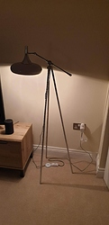

So I have been looking at making some sensors when i stumbled upon the [these PIR sensors](https://www.amazon.co.uk/gp/product/B07RJQMD9G/ref=ppx_yo_dt_b_asin_title_o01_s00?ie=UTF8&psc=1).

After a quick check I realised that they would fit nicely where the button goes on the S26 and as i had a faulty one laying around doing nothing I thought that I might try it.

**!!DISCLAIMER!!**

You do this project at your own risk!

I am not a qualified electrician, but I am an idiot. This project involves working with the mains power supply so DO NOT be an idiot like me and seek help from a qualified professional when it comes working with high voltages.

**Here are the list of products I used:**
[Sonoff S26](https://www.amazon.co.uk/Charging-Control-Wireless-Assistant-Arisesun/dp/B07KT11VHB/ref=asc_df_B07KT11VHB/)
[AC-DC Converter 110V 220V 230V to 5V](https://www.ebay.co.uk/itm/AC-DC-Converter-110V-220V-230V-to-5V-Isolated-Switching-Power-Supply-BoarYNFK/123918113899)
[IR Pyroelectric Infrared PIR Motion Sensor](https://www.amazon.co.uk/gp/product/B07RJQMD9G/ref=ppx_yo_dt_b_asin_title_o01_s00?ie=UTF8&psc=1)
[Wemos D1 Mini](https://www.ebay.co.uk/itm/D1-Mini-NodeMcu-4M-bytes-Lua-WIFI-Development-Boards-ESP8266-by-WeMos-LU/153261545552)

## Setup ##

Once you have setup your hardware and software, you now need to download this project, by clicking `clone -> Download ZIP`.

Unzip the file and navigate to the contents. you should see a file named `My_Helper_sample.h`, go ahead and rename it to `My_Helper.h`.

Now open `pir_sensor.ino`. Doing so should open it in the [Arduino IDE](https://www.arduino.cc/en/main/software).

You do not need to make any changes to the `pir_sensor` script itself!

Click on the `My_Helper.h` tab, that is where you will add your WiFi credentials for your home network, your MQTT username & password and your cars WiFi SSID.

**Here is how i did it:**

* Removed the Sonoff S26's circuitry leaving just the live and neutral wire.
* Soldered the live and neutral wires to the  buck converter.
* Soldered the +/- wires for the 5V output.
* Soldered the 5V output wires to a micro USB plug.
* Soldered the wires to the 5V, Ground & D1 GPIO pins.
* Used the Arduino IDE to upload the script below.
* Carefully put all parts into the S26 and screw it back together.

     

**Arduino Settings**

* Board Manager: http://arduino.esp8266.com/stable/package_esp8266com_index.json
* Upload Settings
